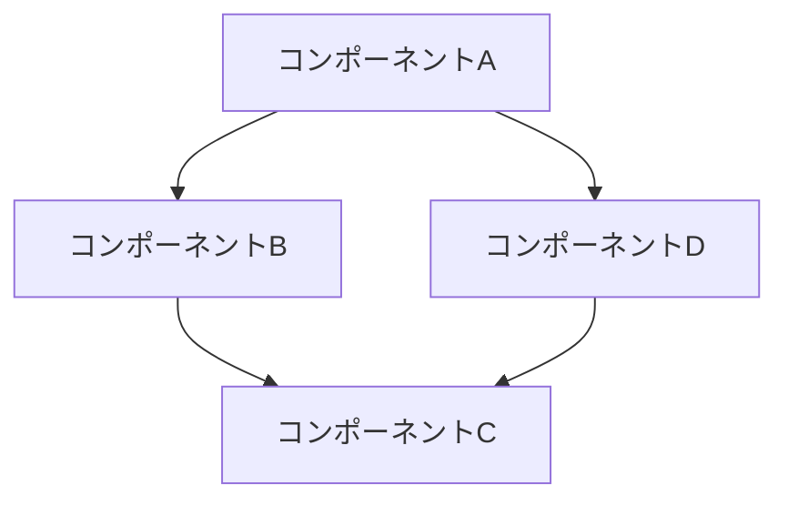

# System Patterns

## System Architecture

[システム全体のアーキテクチャを説明するのだ。図やダイアグラムを含めると良いのだ]



## Key Components

### [コンポーネント 1]

- **目的**: [このコンポーネントの役割]
- **責務**: [このコンポーネントが担当する機能]
- **依存関係**: [他のコンポーネントとの関係]
- **実装詳細**: [実装に関する重要な情報]

### [コンポーネント 2]

- **目的**: [このコンポーネントの役割]
- **責務**: [このコンポーネントが担当する機能]
- **依存関係**: [他のコンポーネントとの関係]
- **実装詳細**: [実装に関する重要な情報]

## データフロー

[システム内でのデータの流れを説明するのだ]

```mermaid
sequenceDiagram
    Actor->>Component A: アクション
    Component A->>Component B: データ
    Component B->>Component C: 処理結果
    Component C-->>Actor: レスポンス
```

## デザインパターン

### [パターン 1]

- **使用箇所**: [このパターンを使用している場所]
- **目的**: [このパターンを採用した理由]
- **実装詳細**: [実装に関する重要な情報]

### [パターン 2]

- **使用箇所**: [このパターンを使用している場所]
- **目的**: [このパターンを採用した理由]
- **実装詳細**: [実装に関する重要な情報]

## 技術的決定

### [決定事項 1]

- **決定**: [技術選定や設計上の決定]
- **理由**: [この決定を行った理由]
- **代替案**: [検討した他の選択肢]
- **トレードオフ**: [この決定に伴うトレードオフ]

### [決定事項 2]

- **決定**: [技術選定や設計上の決定]
- **理由**: [この決定を行った理由]
- **代替案**: [検討した他の選択肢]
- **トレードオフ**: [この決定に伴うトレードオフ]

## システム制約

- [制約 1]
- [制約 2]

## スケーラビリティ考慮事項

[システムのスケーラビリティに関する考慮事項を説明するのだ]

## セキュリティ考慮事項

[システムのセキュリティに関する考慮事項を説明するのだ]

## パフォーマンス考慮事項

[システムのパフォーマンスに関する考慮事項を説明するのだ]

## 将来の拡張性

[将来的な拡張や変更に対する考慮事項を説明するのだ]
